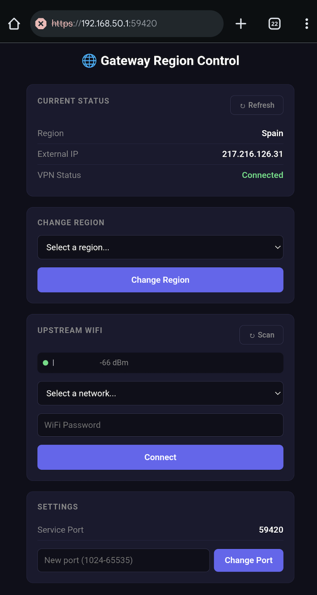

# Proxy Router

A multi-layer, fail-shut proxy network for secure OSINT collection.

```
                                                                           888                    
                                                                           888                    
                                                                           888                    
88888b.  888d888 .d88b.  888  888 888  888        888d888 .d88b.  888  888 888888 .d88b.  888d888 
888 "88b 888P"  d88""88b `Y8bd8P' 888  888        888P"  d88""88b 888  888 888   d8P  Y8b 888P"   
888  888 888    888  888   X88K   888  888 888888 888    888  888 888  888 888   88888888 888     
888 d88P 888    Y88..88P .d8""8b. Y88b 888        888    Y88..88P Y88b 888 Y88b. Y8b.     888     
88888P"  888     "Y88P"  888  888  "Y88888        888     "Y88P"   "Y88888  "Y888 "Y8888  888     
888                                    888                                                        
888                               Y8b d88P                                                        
888                                "Y88P"                                                                   

 ┌────────┐      ┌─────────┐      ┌─────────┐      ┌──────────┐
 │ Client │─WiFi─│   RPI   │─WG───│   VPS   │─VPN──│ Internet │
 └────────┘      │ Gateway │      │  Node   │      └──────────┘
                 └────┬────┘      └────┬────┘
                   fail-shut        fail-shut
```

## Architecture

```
Client Device ──WiFi──► RPI Gateway ──WireGuard──► VPS Node ──NordVPN──► Internet
   (phone/laptop)       (fail-shut)                (fail-shut)     └──► Tor ──► .onion
```

**Three layers of fail-shut protection:**
1. **Client Devices** - Connect to RPI WiFi AP, no direct internet route
2. **RPI Gateway** - iptables DROP policy; only WireGuard UDP to VPS allowed
3. **VPS Node** - NordVPN kill switch blocks all traffic if VPN drops

**Key design principle:** Full network routing, not a proxy. Client devices need zero configuration - all traffic is transparently routed through the VPN chain. This will work on the RPI3b+ without a secondary wireless adapter using the wired NIC as the upstream interface. If you want to use this to hop on other wireless networks and then rebroadcast your own wireless network, you will need a secondary wireless card. 
If you are using this in wireless mode, allow your RPI3b+ to load and run the first apt update before adding the second wireless card and running the RPI install script.

### Example RPi 3b+ AP UI:



## Quick Start

See [QUICKSTART.md](QUICKSTART.md) for step-by-step deployment.

## Tested Hardware

1. **Raspberry Pi 3b+** (https://www.newegg.com/p/0ZK-066J-00012)
2. **Panda Wireless® PAU0A AC600 Dual Band (2.4GHz and 5GHz) Wireless AC USB Adapter** (https://www.newegg.com/p/0XM-0717-00006)

### TL;DR

1. **VPS**: Run `vps/install.sh --token YOUR_TOKEN --region us` (handles Docker, firewall, keys)
2. **RPI**: Copy WireGuard config from VPS, run `rpi-gateway/install.sh` with AP credentials
3. **Connect**: Join the WiFi AP, all traffic routes through VPN

## Project Structure

```
proxy-router/
├── vps/                        # VPS node (Docker)
│   ├── install.sh              # Full installer (Docker, firewall, keys, containers)
│   ├── health-check.sh         # Validation script
│   ├── docker-compose.yml      # Container orchestration
│   ├── .env.example            # Environment variable template
│   └── docker/
│       ├── nordvpn/
│       │   ├── Dockerfile      # NordVPN container image
│       │   └── entrypoint.sh   # Container startup with kill switch
│       └── tor/
│           └── torrc           # Tor SOCKS proxy configuration
│
├── rpi-gateway/                # Raspberry Pi gateway
│   ├── install.sh              # Full installer (hostapd, dnsmasq, wireguard, iptables)
│   ├── health-check.sh         # Validation script
│   └── README.md               # Detailed RPI documentation
│
├── tests/                      # Script validation tests
│   ├── test-vps-scripts.sh     # VPS script tests
│   ├── test-rpi-scripts.sh     # RPI script tests
│   └── README.md               # Test documentation
│
├── proxy-router-example.png    # Architecture diagram
├── QUICKSTART.md               # Step-by-step deployment guide
└── README.md                   # Project overview
```

## Features

- **Fail-shut networking** - Traffic is blocked, not leaked, if VPN drops
- **Full network routing** - No proxy configuration needed on clients
- **WiFi Access Point** - RPI creates secure WiFi for client devices
- **Runtime region switching** - Change VPN region without restarting containers
- **Region Control Web UI** - Easy region switching from any device on the network
- **VPN → Tor chain** - Access .onion sites through VPN first
- **Auto server rotation** - Configurable rotation within region
- **GL.iNet compatible** - Works with consumer WireGuard routers

## Configuration

### VPS `.env`

```bash
NORDVPN_TOKEN=your_token_here    # Required: from NordVPN dashboard
NORDVPN_REGION=us                 # VPN region (us, uk, de, etc.)
WG_PORT=51820                     # WireGuard server port
ROTATION_INTERVAL=3600            # Server rotation interval (seconds, 0 to disable)
```

### RPI Install Options

```bash
sudo ./install.sh \
  --wg-config ~/peer_gateway.conf \    # Required: WireGuard config from VPS
  --ap-ssid "SecureNet" \              # WiFi network name
  --ap-password "YourPassword" \       # WiFi password (min 8 chars)
  --ap-channel 7                       # WiFi channel (1-13)
```

### RPI Region Service (Optional)

To enable the web-based region control service:
```bash
# First, copy the region-changer SSH key from VPS
scp -P 32222 root@VPS_IP:/opt/proxy-router/keys/region-changer /tmp/region-key

# Then include these options during RPI install:
sudo ./install.sh \
  --wg-config ~/peer_gateway.conf \
  --ap-ssid "SecureNet" \
  --ap-password "YourPassword" \
  --vps-ip VPS_IP \                    # VPS IP address
  --region-key /tmp/region-key \       # SSH key from VPS
  --region-password "WebUIPassword"    # Password for web interface
```

## Operations

### Change VPN Region

**Method 1: Web UI (Recommended for RPI users)**

If you installed the RPI with region service enabled, use the web interface:
1. Connect to the RPI WiFi network
2. Open `https://192.168.50.1:59420` in your browser
3. Accept the self-signed certificate warning
4. Login with username `admin` and your region password
5. Select a region and click "Change Region"

**Method 2: curl API**

From any device on the RPI WiFi:
```bash
# Check current status
curl -sk -u admin:YOURPASSWORD https://192.168.50.1:59420/api/status

# Change region
curl -sk -u admin:YOURPASSWORD -X POST -d '{"region":"uk"}' https://192.168.50.1:59420/api/region
```

**Method 3: SSH to VPS (Direct)**

Permanent change (persists across container restarts):
```bash
# SSH to VPS
ssh -p 32222 root@VPS_IP

# Update the config and apply
sed -i 's/NORDVPN_REGION=.*/NORDVPN_REGION=uk/' /opt/proxy-router/vps/.env
docker exec nordvpn nordvpn disconnect && docker exec nordvpn nordvpn connect uk
```

Quick temporary change (reverts if container restarts):
```bash
ssh -p 32222 root@VPS_IP "docker exec nordvpn nordvpn disconnect && docker exec nordvpn nordvpn connect uk"
```

Available regions: `us`, `uk`, `de`, `nl`, `ch`, `se`, `ca`, `au`, `jp`, `sg`, `fr`, `it`, `es`, `pl`, `ro`, `hk`, `br`, `mx`, `in`, `za`

WireGuard clients will automatically use the new VPN exit IP after the region change.

### Check Status

**VPS:**
```bash
docker exec nordvpn nordvpn status     # VPN connection
docker exec wireguard wg show          # WireGuard peers
docker logs -f nordvpn                 # Follow logs
```

**RPI:**
```bash
gateway-wifi status    # All services
gateway-wifi test      # Test VPN connectivity
sudo wg show wg0       # WireGuard tunnel
```

### Verify Fail-Shut

Test that traffic is blocked (not leaked) when VPN is down:

```bash
# On RPI
sudo wg-quick down wg0

# From client device - should TIMEOUT, not show real IP
curl https://api.ipify.org

# Restore
sudo wg-quick up wg0
```

## Troubleshooting

### VPS: NordVPN container won't start / stuck on "daemon already running"

```bash
cd /opt/proxy-router/vps
docker compose down
docker volume rm vps_nordvpn_data
docker compose up -d
```

### VPS: WireGuard not accepting connections

```bash
# Check if WireGuard passthrough rules exist
docker exec nordvpn iptables -t mangle -L PREROUTING -n | head -5
# Should show: ACCEPT udp dpt:51820

# Check WireGuard is listening
docker exec wireguard wg show
```

### RPI: Clients not getting internet after region change

The WireGuard tunnel usually continues working after a region change, but may need to re-handshake.

If clients can't connect after changing region:
```bash
# On RPI
sudo wg-quick down wg0 && sudo wg-quick up wg0
```

### RPI: WiFi AP not starting

```bash
systemctl status hostapd
journalctl -u hostapd -n 50

# Common fix: kill conflicting wpa_supplicant
sudo killall wpa_supplicant
sudo systemctl restart hostapd
```

### RPI: WireGuard handshake failing

```bash
sudo wg show wg0
# Check "latest handshake" - should be recent

# Verify the endpoint is reachable
ping VPS_IP

# Check config matches VPS
sudo cat /etc/wireguard/wg0.conf
```

### RPI: Can't SSH after install

This is expected if you were connected via WiFi - the WiFi interface becomes an AP.

Reconnect via:
1. Ethernet (if connected)
2. Connect to the new AP and SSH to `192.168.50.1`

## Security Notes

| Component | Protection |
|-----------|------------|
| VPS SSH | Port 32222, fail2ban (NOT port 22) |
| VPS Firewall | UFW: only SSH + WireGuard allowed |
| NordVPN | Built-in kill switch enabled |
| WireGuard | Passthrough rules in NordVPN firewall |
| RPI Firewall | iptables DROP policy; only WG UDP out |
| DNS | NordVPN DNS (103.86.96.100) via tunnel |
| IPv6 | Disabled on RPI to prevent leaks |

## FAQ

**Q: Can I use this without an RPI?**
A: Yes, use a GL.iNet router as the gateway, or any device that can run WireGuard with a kill switch.

**Q: How do I access .onion sites?**
A: The VPS runs a Tor container. From any device on the WiFi AP, configure your browser to use SOCKS5 proxy at `10.100.0.1:9050`. Traffic flows: Client → RPI → WireGuard → VPS → Tor → .onion. To verify it's working: `curl --socks5-hostname 10.100.0.1:9050 https://check.torproject.org/api/ip` should return `{"IsTor":true,...}`

**Q: What happens if NordVPN disconnects?**
A: The NordVPN container has a kill switch that blocks all traffic. The entrypoint script also monitors and auto-reconnects.

**Q: Can multiple devices connect to the RPI?**
A: Yes, the RPI acts as a standard WiFi access point. All connected devices share the VPN tunnel.

**Q: How do I update the VPS after making code changes?**
A: Copy the updated files and restart:
```bash
scp -P 32222 -r vps/ root@VPS_IP:/opt/proxy-router/
ssh -p 32222 root@VPS_IP "cd /opt/proxy-router/vps && docker compose down && docker compose up -d"
```

**Q: Does server rotation affect client connections?**
A: Rotation reconnects within the same region. There's a brief (~10 second) interruption. The WireGuard tunnel stays up.

**Q: Why did my region revert after a container restart?**
A: The container uses `NORDVPN_REGION` from `/opt/proxy-router/vps/.env` when it starts. If you changed the region with just `docker exec nordvpn nordvpn connect`, that's a temporary change. To make it permanent, also update the `.env` file:
```bash
sed -i 's/NORDVPN_REGION=.*/NORDVPN_REGION=uk/' /opt/proxy-router/vps/.env
```

## License

MIT
